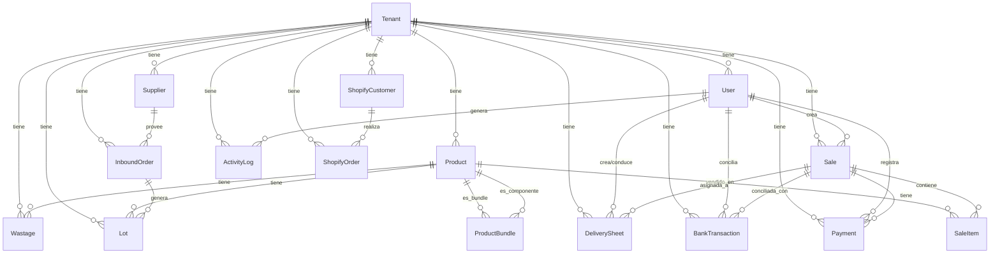

# MODELS DOCUMENTATION - SIPUD

## Índice

1. [**Tenant (Multi-Tenant)**](#tenant-multi-tenant)
2. [**User (Usuarios)**](#user-usuarios)
3. [**Product (Productos)**](#product-productos)
4. [**ProductBundle (Kits/Bundles)**](#productbundle-kitsbundles)
5. [**Supplier (Proveedores)**](#supplier-proveedores)
6. [**InboundOrder (Pedidos a Proveedores)**](#inboundorder-pedidos-a-proveedores)
7. [**Lot (Lotes de Inventario)**](#lot-lotes-de-inventario)
8. [**Sale (Ventas)**](#sale-ventas)
9. [**SaleItem (Items de Venta)**](#saleitem-items-de-venta)
10. [**Payment (Pagos)**](#payment-pagos)
11. [**Wastage (Mermas)**](#wastage-mermas)
12. [**ActivityLog (Auditoría)**](#activitylog-auditoría)
13. [**ShopifyCustomer (Clientes Shopify)**](#shopifycustomer-clientes-shopify)
14. [**ShopifyOrder (Órdenes Shopify)**](#shopifyorder-órdenes-shopify)
15. [**BankTransaction (Transacciones Bancarias)**](#banktransaction-transacciones-bancarias)
16. [**DeliverySheet (Hojas de Reparto)**](#deliverysheet-hojas-de-reparto)
17. [**Truck (Vehículos Fleet)**](#truck-vehículos-fleet)
18. [**VehicleMaintenance (Mantenimiento Vehículos)**](#vehiclemaintenance-mantenimiento-vehículos)
19. [**LogisticsRoute (Rutas Logísticas)**](#logisticsroute-rutas-logísticas)

---

## Convenciones

### ODM: MongoEngine

Todos los modelos heredan de:
- `db.Document` → Colecciones MongoDB
- `db.EmbeddedDocument` → Documentos embebidos (no tienen colección propia)

### Campos (Field Types)

| MongoEngine | MongoDB Type | Python Type |
|-------------|--------------|-------------|
| `StringField` | string | str |
| `IntField` | int32/int64 | int |
| `FloatField` | double | float |
| `DecimalField` | decimal128 | Decimal |
| `BooleanField` | bool | bool |
| `DateField` | date | datetime.date |
| `DateTimeField` | date | datetime.datetime |
| `ReferenceField` | ObjectId | Document |
| `ListField` | array | list |
| `DictField` | object | dict |
| `EmbeddedDocumentField` | object | EmbeddedDocument |

### Metadata (`meta`)

```python
meta = {
    'collection': 'nombre_coleccion',  # Nombre de la colección MongoDB
    'indexes': [...],                   # Índices para optimizar queries
    'ordering': ['-created_at']         # Orden por defecto
}
```

### Índices

Los índices se crean automáticamente en MongoDB al iniciar la aplicación. Optimizan queries frecuentes.

---

## Tenant (Multi-Tenant)

**Descripción:** Organización/empresa. Aísla datos entre diferentes clientes del sistema.

**Colección:** `tenants`

### Campos

| Campo | Tipo | Requerido | Único | Descripción |
|-------|------|-----------|-------|-------------|
| `name` | String (100) | ✅ | ✅ | Nombre de la organización |
| `slug` | String (50) | ✅ | ✅ | Identificador URL-friendly |
| `created_at` | DateTime | ✅ | ❌ | Fecha de creación (auto) |

### Schema

```python
class Tenant(db.Document):
    name = db.StringField(max_length=100, unique=True, required=True)
    slug = db.StringField(max_length=50, unique=True, required=True)
    created_at = db.DateTimeField(default=datetime.utcnow)
    meta = {'collection': 'tenants'}
```

### Ejemplo

```json
{
  "_id": ObjectId("507f1f77bcf86cd799439011"),
  "name": "Puerto Distribución",
  "slug": "puerto-distribucion",
  "created_at": ISODate("2026-01-01T00:00:00Z")
}
```

---

## User (Usuarios)

**Descripción:** Usuario del sistema con autenticación y permisos RBAC.

**Colección:** `users`

### Campos

| Campo | Tipo | Requerido | Único | Descripción |
|-------|------|-----------|-------|-------------|
| `username` | String (64) | ✅ | ✅ | Nombre de usuario (login) |
| `email` | String (120) | ❌ | ✅ (sparse) | Email (opcional) |
| `password_hash` | String (256) | ✅ | ❌ | Contraseña hasheada (bcrypt) |
| `role` | String (20) | ✅ | ❌ | Rol: admin, manager, warehouse, sales |
| `full_name` | String (100) | ❌ | ❌ | Nombre completo |
| `is_active` | Boolean | ✅ | ❌ | Usuario activo (default: true) |
| `tenant` | ReferenceField | ✅ | ❌ | Tenant al que pertenece |
| `created_at` | DateTime | ✅ | ❌ | Fecha de creación (auto) |
| `last_login` | DateTime | ❌ | ❌ | Última sesión |

### Schema

```python
class User(db.Document, UserMixin):
    username = db.StringField(max_length=64, unique=True, required=True)
    email = db.StringField(max_length=120, unique=True, sparse=True)
    password_hash = db.StringField(max_length=256)
    role = db.StringField(max_length=20, required=True)
    full_name = db.StringField(max_length=100)
    is_active = db.BooleanField(default=True)
    tenant = db.ReferenceField(Tenant)
    created_at = db.DateTimeField(default=datetime.utcnow)
    last_login = db.DateTimeField()
    meta = {'collection': 'users'}
```

### Métodos

```python
def set_password(self, password):
    """Hashea y guarda contraseña"""
    self.password_hash = generate_password_hash(password)

def check_password(self, password):
    """Verifica contraseña"""
    return check_password_hash(self.password_hash, password)

def has_permission(self, module, action='view'):
    """Verifica permisos RBAC"""
    role_perms = ROLE_PERMISSIONS.get(self.role, {})
    module_perms = role_perms.get(module, [])
    return action in module_perms

def get_permissions(self):
    """Retorna todos los permisos del rol"""
    return ROLE_PERMISSIONS.get(self.role, {})
```

### Roles y Permisos

Definidos en `ROLE_PERMISSIONS`:

```python
ROLE_PERMISSIONS = {
    'admin': {
        'users': ['view', 'create', 'edit', 'delete'],
        'products': ['view', 'create', 'edit', 'delete'],
        'sales': ['view', 'create', 'edit', 'cancel'],
        'orders': ['view', 'create', 'receive', 'delete'],
        'wastage': ['view', 'create', 'delete'],
        'reports': ['view', 'export'],
        'activity_log': ['view'],
        'customers': ['view', 'create', 'export', 'sync'],
    },
    'manager': {
        'users': ['view', 'create', 'edit'],
        'products': ['view', 'create', 'edit', 'delete'],
        'sales': ['view', 'create', 'edit', 'cancel'],
        'orders': ['view', 'create', 'receive', 'delete'],
        'wastage': ['view', 'create', 'delete'],
        'reports': ['view', 'export'],
        'activity_log': [],
        'customers': ['view', 'create', 'export'],
    },
    'warehouse': {
        'users': [],
        'products': ['view'],
        'sales': ['view'],
        'orders': ['view', 'create', 'receive'],
        'wastage': ['view', 'create'],
        'reports': ['view'],
        'activity_log': [],
        'customers': [],
    },
    'sales': {
        'users': [],
        'products': ['view'],
        'sales': ['view', 'create'],
        'orders': [],
        'wastage': [],
        'reports': ['view', 'export'],
        'activity_log': [],
        'customers': ['view'],
    },
}
```

### Ejemplo

```json
{
  "_id": ObjectId("507f1f77bcf86cd799439012"),
  "username": "admin",
  "email": "admin@example.com",
  "password_hash": "$2b$12$...",
  "role": "admin",
  "full_name": "Administrador",
  "is_active": true,
  "tenant": ObjectId("507f1f77bcf86cd799439011"),
  "created_at": ISODate("2026-01-01T08:00:00Z"),
  "last_login": ISODate("2026-02-04T10:30:00Z")
}
```

---

## Product (Productos)

**Descripción:** Producto/SKU en el catálogo del inventario.

**Colección:** `products`

### Campos

| Campo | Tipo | Requerido | Único | Descripción |
|-------|------|-----------|-------|-------------|
| `name` | String (100) | ✅ | ❌ | Nombre del producto |
| `sku` | String (50) | ✅ | ✅ | Código SKU único |
| `base_price` | Decimal (2) | ❌ | ❌ | Precio base (default: 0) |
| `critical_stock` | Integer | ❌ | ❌ | Stock crítico (default: 10) |
| `category` | String (100) | ❌ | ❌ | Categoría (default: 'Otros') |
| `tags` | String (200) | ❌ | ❌ | Tags separados por comas |
| `description` | String | ❌ | ❌ | Descripción del producto |
| `expiry_date` | Date | ❌ | ❌ | Fecha de vencimiento |
| `shopify_id` | String (50) | ❌ | ❌ | ID de Shopify (sync) |
| `tenant` | ReferenceField | ✅ | ❌ | Tenant propietario |

### Schema

```python
class Product(db.Document):
    name = db.StringField(max_length=100, required=True)
    sku = db.StringField(max_length=50, unique=True)
    base_price = db.DecimalField(precision=2, default=0)
    critical_stock = db.IntField(default=10)
    category = db.StringField(max_length=100, default='Otros')
    tags = db.StringField(max_length=200)
    description = db.StringField()
    expiry_date = db.DateField()
    shopify_id = db.StringField(max_length=50)
    tenant = db.ReferenceField(Tenant)
    meta = {'collection': 'products'}
```

### Propiedades Calculadas

```python
@property
def total_stock(self):
    """Stock total sumando todos los lotes"""
    lots = Lot.objects(product=self, quantity_current__gt=0)
    return sum(lot.quantity_current for lot in lots)

@property
def is_bundle(self):
    """Verifica si es un bundle (contiene otros productos)"""
    return ProductBundle.objects(bundle=self).count() > 0

@property
def lots(self):
    """Retorna todos los lotes del producto"""
    return Lot.objects(product=self)

@property
def bundle_components(self):
    """Retorna componentes si es bundle"""
    return ProductBundle.objects(bundle=self)
```

### Ejemplo

```json
{
  "_id": ObjectId("507f1f77bcf86cd799439013"),
  "name": "Pan Integral 500g",
  "sku": "PAN-INT-500G",
  "base_price": NumberDecimal("2500.00"),
  "critical_stock": 10,
  "category": "Panadería",
  "tags": "pan,integral,saludable",
  "description": "Pan integral artesanal 500 gramos",
  "expiry_date": ISODate("2027-12-31"),
  "shopify_id": "7891234567890",
  "tenant": ObjectId("507f1f77bcf86cd799439011")
}
```

---

## ProductBundle (Kits/Bundles)

**Descripción:** Relación entre productos bundle y sus componentes. Permite crear kits (ej: caja regalo con varios productos).

**Colección:** `product_bundles`

### Campos

| Campo | Tipo | Requerido | Único | Descripción |
|-------|------|-----------|-------|-------------|
| `bundle` | ReferenceField | ✅ | ❌ | Producto bundle (caja) |
| `component` | ReferenceField | ✅ | ❌ | Producto componente |
| `quantity` | Integer | ✅ | ❌ | Cantidad del componente (default: 1) |
| `tenant` | ReferenceField | ✅ | ❌ | Tenant propietario |

### Schema

```python
class ProductBundle(db.Document):
    bundle = db.ReferenceField(Product, required=True)
    component = db.ReferenceField(Product, required=True)
    quantity = db.IntField(default=1, required=True)
    tenant = db.ReferenceField(Tenant)
    meta = {'collection': 'product_bundles'}
```

### Ejemplo

```json
{
  "_id": ObjectId("507f1f77bcf86cd799439014"),
  "bundle": ObjectId("507f1f77bcf86cd799439015"),  // Caja Regalo
  "component": ObjectId("507f1f77bcf86cd799439013"), // Pan Integral
  "quantity": 2,
  "tenant": ObjectId("507f1f77bcf86cd799439011")
}
```

**Uso:** La "Caja Regalo" contiene 2 unidades de "Pan Integral".

---

## Supplier (Proveedores)

**Descripción:** Proveedor de productos (para pedidos).

**Colección:** `suppliers`

### Campos

| Campo | Tipo | Requerido | Único | Descripción |
|-------|------|-----------|-------|-------------|
| `name` | String (100) | ✅ | ❌ | Nombre del proveedor |
| `rut` | String (20) | ❌ | ✅ (sparse) | RUT/ID fiscal único |
| `contact_info` | String (200) | ❌ | ❌ | Teléfono/email/contacto |
| `tenant` | ReferenceField | ✅ | ❌ | Tenant propietario |

### Schema

```python
class Supplier(db.Document):
    name = db.StringField(max_length=100, required=True)
    rut = db.StringField(max_length=20, unique=True, sparse=True)
    contact_info = db.StringField(max_length=200)
    tenant = db.ReferenceField(Tenant)
    meta = {'collection': 'suppliers'}
```

### Ejemplo

```json
{
  "_id": ObjectId("507f1f77bcf86cd799439016"),
  "name": "Distribuidora ABC",
  "rut": "12345678-9",
  "contact_info": "+56912345678 - ventas@abc.cl",
  "tenant": ObjectId("507f1f77bcf86cd799439011")
}
```

---

## InboundOrder (Pedidos a Proveedores)

**Descripción:** Pedido/orden de compra a un proveedor. Al recibirse, se crean lotes de inventario.

**Colección:** `inbound_orders`

### Campos

| Campo | Tipo | Requerido | Único | Descripción |
|-------|------|-----------|-------|-------------|
| `supplier` | ReferenceField | ❌ | ❌ | Proveedor (puede ser null) |
| `supplier_name` | String (200) | ❌ | ❌ | Nombre del proveedor (cache) |
| `invoice_number` | String (50) | ❌ | ❌ | Número de factura |
| `date_received` | DateTime | ❌ | ❌ | Fecha de recepción |
| `created_at` | DateTime | ✅ | ❌ | Fecha de creación (auto) |
| `total` | Decimal (2) | ❌ | ❌ | Total del pedido (default: 0) |
| `status` | String (20) | ✅ | ❌ | Estado: pending, received, paid |
| `notes` | String | ❌ | ❌ | Notas adicionales |
| `tenant` | ReferenceField | ✅ | ❌ | Tenant propietario |

### Schema

```python
class InboundOrder(db.Document):
    supplier = db.ReferenceField(Supplier)
    supplier_name = db.StringField(max_length=200)
    invoice_number = db.StringField(max_length=50)
    date_received = db.DateTimeField()
    created_at = db.DateTimeField(default=datetime.utcnow)
    total = db.DecimalField(precision=2, default=0)
    status = db.StringField(max_length=20, default='pending')
    notes = db.StringField()
    tenant = db.ReferenceField(Tenant)
    meta = {'collection': 'inbound_orders'}
```

### Propiedades

```python
@property
def lots(self):
    """Retorna todos los lotes asociados a este pedido"""
    return Lot.objects(order=self)
```

### Ejemplo

```json
{
  "_id": ObjectId("507f1f77bcf86cd799439017"),
  "supplier": ObjectId("507f1f77bcf86cd799439016"),
  "supplier_name": "Distribuidora ABC",
  "invoice_number": "F-12345",
  "date_received": ISODate("2026-02-01T10:00:00Z"),
  "created_at": ISODate("2026-01-28T08:00:00Z"),
  "total": NumberDecimal("500000.00"),
  "status": "received",
  "notes": "Pedido mensual",
  "tenant": ObjectId("507f1f77bcf86cd799439011")
}
```

---

## Lot (Lotes de Inventario)

**Descripción:** Lote de inventario (batch) de un producto. Permite trazabilidad FIFO y control de vencimientos.

**Colección:** `lots`

### Campos

| Campo | Tipo | Requerido | Único | Descripción |
|-------|------|-----------|-------|-------------|
| `product` | ReferenceField | ✅ | ❌ | Producto del lote |
| `order` | ReferenceField | ❌ | ❌ | Pedido origen (puede ser null) |
| `tenant` | ReferenceField | ✅ | ❌ | Tenant propietario |
| `lot_code` | String (50) | ❌ | ❌ | Código del lote |
| `quantity_initial` | Integer | ✅ | ❌ | Cantidad inicial |
| `quantity_current` | Integer | ✅ | ❌ | Cantidad actual (descontada) |
| `expiry_date` | Date | ❌ | ❌ | Fecha de vencimiento |
| `created_at` | DateTime | ✅ | ❌ | Fecha de creación (auto) |

### Schema

```python
class Lot(db.Document):
    product = db.ReferenceField(Product, required=True)
    order = db.ReferenceField(InboundOrder)
    tenant = db.ReferenceField(Tenant)
    lot_code = db.StringField(max_length=50)
    quantity_initial = db.IntField(required=True)
    quantity_current = db.IntField(required=True)
    expiry_date = db.DateField()
    created_at = db.DateTimeField(default=datetime.utcnow)
    meta = {'collection': 'lots'}
```

### Ejemplo

```json
{
  "_id": ObjectId("507f1f77bcf86cd799439018"),
  "product": ObjectId("507f1f77bcf86cd799439013"),
  "order": ObjectId("507f1f77bcf86cd799439017"),
  "tenant": ObjectId("507f1f77bcf86cd799439011"),
  "lot_code": "LOT-2026-001",
  "quantity_initial": 100,
  "quantity_current": 85,
  "expiry_date": ISODate("2027-12-31"),
  "created_at": ISODate("2026-02-01T10:00:00Z")
}
```

**Nota:** La diferencia entre `quantity_initial` y `quantity_current` representa lo vendido/consumido.

---

## Sale (Ventas)

**Descripción:** Venta realizada. Puede ser con despacho o venta en local.

**Colección:** `sales`

### Campos

| Campo | Tipo | Requerido | Único | Descripción |
|-------|------|-----------|-------|-------------|
| `customer_name` | String (100) | ❌ | ❌ | Nombre del cliente |
| `address` | String (200) | ❌ | ❌ | Dirección de entrega |
| `phone` | String (20) | ❌ | ❌ | Teléfono del cliente |
| `status` | String (20) | ✅ | ❌ | Estado legacy: pending, assigned, in_transit, delivered, cancelled |
| `payment_method` | String (200) | ❌ | ❌ | **DEPRECATED:** Método de pago (usar Payment) |
| `payment_confirmed` | Boolean | ✅ | ❌ | **DEPRECATED:** Confirmación pago (usar payment_status) |
| `sale_type` | String (20) | ✅ | ❌ | Tipo: con_despacho, en_local |
| `sales_channel` | String (20) | ✅ | ❌ | Canal: manual, whatsapp, shopify, web |
| `delivery_status` | String (20) | ✅ | ❌ | Estado entrega: pendiente, en_preparacion, en_transito, entregado, con_observaciones, cancelado |
| `delivery_observations` | String (500) | ❌ | ❌ | Observaciones de entrega |
| `date_delivered` | DateTime | ❌ | ❌ | Fecha de entrega |
| `payment_status` | String (20) | ✅ | ❌ | Estado pago: pendiente, pagado, parcial |
| `date_created` | DateTime | ✅ | ❌ | Fecha de creación (auto) |
| `shopify_order_id` | String (50) | ❌ | ❌ | ID de orden Shopify (sync) |
| `shopify_order_number` | Integer | ❌ | ❌ | Número de orden Shopify (#1001) |
| `tenant` | ReferenceField | ✅ | ❌ | Tenant propietario |
| `route` | ReferenceField | ❌ | ❌ | Ruta logística (DISABLED) |

### Schema

```python
class Sale(db.Document):
    customer_name = db.StringField(max_length=100)
    address = db.StringField(max_length=200)
    phone = db.StringField(max_length=20)
    status = db.StringField(max_length=20, default='pending')
    payment_method = db.StringField(max_length=200)
    payment_confirmed = db.BooleanField(default=False)
    sale_type = db.StringField(
        max_length=20,
        default='con_despacho',
        choices=['con_despacho', 'en_local']
    )
    sales_channel = db.StringField(
        max_length=20,
        default='manual',
        choices=['manual', 'whatsapp', 'shopify', 'web']
    )
    delivery_status = db.StringField(
        max_length=20,
        default='pendiente',
        choices=['pendiente', 'en_preparacion', 'en_transito', 'entregado', 'con_observaciones', 'cancelado']
    )
    delivery_observations = db.StringField(max_length=500)
    date_delivered = db.DateTimeField()
    payment_status = db.StringField(
        max_length=20,
        default='pendiente',
        choices=['pendiente', 'pagado', 'parcial']
    )
    date_created = db.DateTimeField(default=datetime.utcnow)
    shopify_order_id = db.StringField(max_length=50)
    shopify_order_number = db.IntField()
    tenant = db.ReferenceField(Tenant)
    route = db.ReferenceField('LogisticsRoute')
    meta = {'collection': 'sales'}
```

### Propiedades Calculadas

```python
@property
def items(self):
    """Retorna items de la venta"""
    return SaleItem.objects(sale=self)

@property
def total_amount(self):
    """Calcula monto total"""
    return sum(item.quantity * float(item.unit_price) for item in self.items)

@property
def total_paid(self):
    """Suma todos los pagos registrados"""
    return sum(float(p.amount) for p in Payment.objects(sale=self))

@property
def balance_pending(self):
    """Saldo pendiente"""
    return self.total_amount - self.total_paid

@property
def computed_payment_status(self):
    """Calcula payment_status desde pagos"""
    total = self.total_amount
    paid = self.total_paid
    if paid >= total:
        return 'pagado'
    elif paid > 0:
        return 'parcial'
    else:
        return 'pendiente'

@property
def computed_status(self):
    """Calcula status legacy desde delivery_status"""
    status_map = {
        'pendiente': 'pending',
        'en_preparacion': 'assigned',
        'en_transito': 'in_transit',
        'entregado': 'delivered',
        'con_observaciones': 'delivered',
        'cancelado': 'cancelled'
    }
    return status_map.get(self.delivery_status, 'pending')
```

### Ejemplo

```json
{
  "_id": ObjectId("507f1f77bcf86cd799439019"),
  "customer_name": "Juan Pérez",
  "address": "Av. Principal 123",
  "phone": "+56912345678",
  "status": "pending",
  "payment_method": "Efectivo",
  "payment_confirmed": false,
  "sale_type": "con_despacho",
  "sales_channel": "whatsapp",
  "delivery_status": "pendiente",
  "delivery_observations": "",
  "date_delivered": null,
  "payment_status": "pendiente",
  "date_created": ISODate("2026-02-04T10:30:00Z"),
  "shopify_order_id": null,
  "shopify_order_number": null,
  "tenant": ObjectId("507f1f77bcf86cd799439011"),
  "route": null
}
```

---

## SaleItem (Items de Venta)

**Descripción:** Línea de detalle de una venta (producto + cantidad + precio).

**Colección:** `sale_items`

### Campos

| Campo | Tipo | Requerido | Único | Descripción |
|-------|------|-----------|-------|-------------|
| `sale` | ReferenceField | ✅ | ❌ | Venta a la que pertenece |
| `product` | ReferenceField | ✅ | ❌ | Producto vendido |
| `quantity` | Integer | ✅ | ❌ | Cantidad vendida |
| `unit_price` | Decimal (2) | ✅ | ❌ | Precio unitario |

### Schema

```python
class SaleItem(db.Document):
    sale = db.ReferenceField(Sale, required=True)
    product = db.ReferenceField(Product, required=True)
    quantity = db.IntField(required=True)
    unit_price = db.DecimalField(precision=2, required=True)
    meta = {'collection': 'sale_items'}
```

### Propiedades

```python
@property
def subtotal(self):
    """Calcula subtotal (cantidad * precio)"""
    return self.quantity * float(self.unit_price)
```

### Ejemplo

```json
{
  "_id": ObjectId("507f1f77bcf86cd799439020"),
  "sale": ObjectId("507f1f77bcf86cd799439019"),
  "product": ObjectId("507f1f77bcf86cd799439013"),
  "quantity": 5,
  "unit_price": NumberDecimal("2500.00")
}
```

**Subtotal:** 5 × $2,500 = $12,500

---

## Payment (Pagos)

**Descripción:** Registro de pago/abono para una venta. Permite pagos parciales y múltiples abonos.

**Colección:** `payments`

### Campos

| Campo | Tipo | Requerido | Único | Descripción |
|-------|------|-----------|-------|-------------|
| `sale` | ReferenceField | ✅ | ❌ | Venta a la que pertenece el pago |
| `tenant` | ReferenceField | ✅ | ❌ | Tenant propietario |
| `amount` | Decimal (2) | ✅ | ❌ | Monto del pago |
| `payment_via` | String (50) | ✅ | ❌ | Vía: efectivo, transferencia, tarjeta, otro |
| `payment_reference` | String (200) | ❌ | ❌ | Referencia (número transferencia, etc.) |
| `notes` | String (500) | ❌ | ❌ | Notas adicionales |
| `date_created` | DateTime | ✅ | ❌ | Fecha del pago (auto) |
| `created_by` | ReferenceField | ❌ | ❌ | Usuario que registró el pago |

### Schema

```python
class Payment(db.Document):
    sale = db.ReferenceField(Sale, required=True)
    tenant = db.ReferenceField(Tenant, required=True)
    amount = db.DecimalField(precision=2, required=True)
    payment_via = db.StringField(
        max_length=50,
        required=True,
        choices=['efectivo', 'transferencia', 'tarjeta', 'otro']
    )
    payment_reference = db.StringField(max_length=200)
    notes = db.StringField(max_length=500)
    date_created = db.DateTimeField(default=datetime.utcnow)
    created_by = db.ReferenceField(User)
    meta = {
        'collection': 'payments',
        'indexes': ['sale', 'tenant', '-date_created'],
        'ordering': ['-date_created']
    }
```

### Ejemplo

```json
{
  "_id": ObjectId("507f1f77bcf86cd799439021"),
  "sale": ObjectId("507f1f77bcf86cd799439019"),
  "tenant": ObjectId("507f1f77bcf86cd799439011"),
  "amount": NumberDecimal("5000.00"),
  "payment_via": "transferencia",
  "payment_reference": "TRF-12345",
  "notes": "Primer abono",
  "date_created": ISODate("2026-02-04T11:00:00Z"),
  "created_by": ObjectId("507f1f77bcf86cd799439012")
}
```

---

## Wastage (Mermas)

**Descripción:** Registro de mermas y pérdidas de productos (vencido, dañado, perdido, robo).

**Colección:** `wastages`

### Campos

| Campo | Tipo | Requerido | Único | Descripción |
|-------|------|-----------|-------|-------------|
| `product` | ReferenceField | ✅ | ❌ | Producto afectado |
| `quantity` | Integer | ✅ | ❌ | Cantidad perdida |
| `reason` | String (200) | ✅ | ❌ | Razón: vencido, dañado, perdido, robo, otro |
| `notes` | String | ❌ | ❌ | Notas adicionales |
| `date_created` | DateTime | ✅ | ❌ | Fecha de registro (auto) |
| `tenant` | ReferenceField | ✅ | ❌ | Tenant propietario |

### Schema

```python
class Wastage(db.Document):
    product = db.ReferenceField(Product, required=True)
    quantity = db.IntField(required=True)
    reason = db.StringField(max_length=200, required=True)
    notes = db.StringField()
    date_created = db.DateTimeField(default=datetime.utcnow)
    tenant = db.ReferenceField(Tenant)
    meta = {'collection': 'wastages'}
```

### Ejemplo

```json
{
  "_id": ObjectId("507f1f77bcf86cd799439022"),
  "product": ObjectId("507f1f77bcf86cd799439013"),
  "quantity": 10,
  "reason": "vencido",
  "notes": "Lote LOT-2026-001 vencido, descartar",
  "date_created": ISODate("2026-02-04T12:00:00Z"),
  "tenant": ObjectId("507f1f77bcf86cd799439011")
}
```

---

## ActivityLog (Auditoría)

**Descripción:** Log de auditoría de todas las actividades del sistema (solo visible para admins).

**Colección:** `activity_logs`

### Campos

| Campo | Tipo | Requerido | Único | Descripción |
|-------|------|-----------|-------|-------------|
| `user` | ReferenceField | ✅ | ❌ | Usuario que realizó la acción |
| `user_name` | String (100) | ❌ | ❌ | Nombre del usuario (cache) |
| `user_role` | String (20) | ❌ | ❌ | Rol del usuario (cache) |
| `action` | String (50) | ✅ | ❌ | Acción: create, update, delete, login, logout, etc. |
| `module` | String (50) | ✅ | ❌ | Módulo: products, sales, users, orders, etc. |
| `description` | String (500) | ❌ | ❌ | Descripción legible |
| `details` | Dict | ❌ | ❌ | Detalles adicionales (JSON) |
| `target_id` | String (50) | ❌ | ❌ | ID del objeto afectado |
| `target_type` | String (50) | ❌ | ❌ | Tipo de objeto (Product, Sale, etc.) |
| `ip_address` | String (45) | ❌ | ❌ | IP del cliente |
| `user_agent` | String (500) | ❌ | ❌ | User-Agent del navegador |
| `tenant` | ReferenceField | ❌ | ❌ | Tenant propietario |
| `created_at` | DateTime | ✅ | ❌ | Fecha de la acción (auto) |

### Schema

```python
class ActivityLog(db.Document):
    user = db.ReferenceField('User', required=True)
    user_name = db.StringField(max_length=100)
    user_role = db.StringField(max_length=20)
    action = db.StringField(max_length=50, required=True)
    module = db.StringField(max_length=50, required=True)
    description = db.StringField(max_length=500)
    details = db.DictField()
    target_id = db.StringField(max_length=50)
    target_type = db.StringField(max_length=50)
    ip_address = db.StringField(max_length=45)
    user_agent = db.StringField(max_length=500)
    tenant = db.ReferenceField(Tenant)
    created_at = db.DateTimeField(default=datetime.utcnow)
    meta = {
        'collection': 'activity_logs',
        'indexes': ['-created_at', 'user', 'action', 'module', 'tenant'],
        'ordering': ['-created_at']
    }
```

### Método Helper

```python
@classmethod
def log(cls, user, action, module, description=None, details=None,
        target_id=None, target_type=None, request=None, tenant=None):
    log_entry = cls(
        user=user,
        user_name=user.full_name or user.username,
        user_role=user.role,
        action=action,
        module=module,
        description=description,
        details=details or {},
        target_id=target_id,
        target_type=target_type,
        ip_address=request.remote_addr if request else None,
        user_agent=request.user_agent.string[:500] if request and request.user_agent else None,
        tenant=tenant or (user.tenant if user else None)
    )
    log_entry.save()
    return log_entry
```

### Ejemplo

```json
{
  "_id": ObjectId("507f1f77bcf86cd799439023"),
  "user": ObjectId("507f1f77bcf86cd799439012"),
  "user_name": "Administrador",
  "user_role": "admin",
  "action": "create",
  "module": "products",
  "description": "Creó producto \"Pan Integral\" (SKU: PAN-INT-500G, stock inicial: 100)",
  "details": {
    "sku": "PAN-INT-500G",
    "initial_stock": 100
  },
  "target_id": "507f1f77bcf86cd799439013",
  "target_type": "Product",
  "ip_address": "192.168.1.100",
  "user_agent": "Mozilla/5.0 ...",
  "tenant": ObjectId("507f1f77bcf86cd799439011"),
  "created_at": ISODate("2026-02-04T10:00:00Z")
}
```

---

## ShopifyCustomer (Clientes Shopify)

**Descripción:** Cliente sincronizado desde Shopify o creado manualmente.

**Colección:** `shopify_customers`

### Campos

| Campo | Tipo | Requerido | Único | Descripción |
|-------|------|-----------|-------|-------------|
| `name` | String (200) | ❌ | ❌ | Nombre del cliente |
| `email` | String (200) | ❌ | ❌ | Email |
| `phone` | String (50) | ❌ | ❌ | Teléfono |
| `address_city` | String (100) | ❌ | ❌ | Ciudad |
| `address_province` | String (100) | ❌ | ❌ | Provincia/Región |
| `address_country` | String (100) | ❌ | ❌ | País |
| `source` | String (20) | ✅ | ❌ | Origen: shopify, manual, import |
| `shopify_id` | String (50) | ❌ | ✅ (sparse) | ID de Shopify |
| `tags` | String (500) | ❌ | ❌ | Tags (Shopify) |
| `total_orders` | Integer | ✅ | ❌ | Total de pedidos (default: 0) |
| `total_spent` | Decimal (2) | ✅ | ❌ | Total gastado (default: 0) |
| `first_order_date` | DateTime | ❌ | ❌ | Fecha primer pedido |
| `last_order_date` | DateTime | ❌ | ❌ | Fecha último pedido |
| `created_at` | DateTime | ❌ | ❌ | Fecha de creación |
| `updated_at` | DateTime | ✅ | ❌ | Fecha de actualización (auto) |
| `tenant` | ReferenceField | ✅ | ❌ | Tenant propietario |

### Schema

```python
class ShopifyCustomer(db.Document):
    name = db.StringField(max_length=200)
    email = db.StringField(max_length=200)
    phone = db.StringField(max_length=50)
    address_city = db.StringField(max_length=100)
    address_province = db.StringField(max_length=100)
    address_country = db.StringField(max_length=100)
    source = db.StringField(max_length=20, default='shopify', choices=['shopify', 'manual', 'import'])
    shopify_id = db.StringField(max_length=50, unique=True, sparse=True)
    tags = db.StringField(max_length=500)
    total_orders = db.IntField(default=0)
    total_spent = db.DecimalField(precision=2, default=0)
    first_order_date = db.DateTimeField()
    last_order_date = db.DateTimeField()
    created_at = db.DateTimeField()
    updated_at = db.DateTimeField(default=datetime.utcnow)
    tenant = db.ReferenceField(Tenant)
    meta = {
        'collection': 'shopify_customers',
        'indexes': ['shopify_id', 'email', 'tenant', '-total_spent', '-created_at']
    }
```

### Propiedades

```python
@property
def orders(self):
    """Retorna todas las órdenes del cliente"""
    return ShopifyOrder.objects(customer=self).order_by('-created_at')

@property
def last_order(self):
    """Retorna la orden más reciente"""
    return ShopifyOrder.objects(customer=self).order_by('-created_at').first()
```

### Ejemplo

```json
{
  "_id": ObjectId("507f1f77bcf86cd799439024"),
  "name": "María González",
  "email": "maria@example.com",
  "phone": "+56987654321",
  "address_city": "Santiago",
  "address_province": "Región Metropolitana",
  "address_country": "Chile",
  "source": "shopify",
  "shopify_id": "7891234567891",
  "tags": "vip,mayorista",
  "total_orders": 15,
  "total_spent": NumberDecimal("450000.00"),
  "first_order_date": ISODate("2025-06-15T00:00:00Z"),
  "last_order_date": ISODate("2026-02-01T00:00:00Z"),
  "created_at": ISODate("2025-06-15T00:00:00Z"),
  "updated_at": ISODate("2026-02-04T00:00:00Z"),
  "tenant": ObjectId("507f1f77bcf86cd799439011")
}
```

---

## ShopifyOrder (Órdenes Shopify)

**Descripción:** Orden sincronizada desde Shopify (solo lectura, no editable).

**Colección:** `shopify_orders`

### Campos

| Campo | Tipo | Requerido | Único | Descripción |
|-------|------|-----------|-------|-------------|
| `order_number` | Integer | ❌ | ❌ | Número de orden (#1001) |
| `shopify_id` | String (50) | ✅ | ✅ | ID de Shopify |
| `customer` | ReferenceField | ❌ | ❌ | Cliente (ShopifyCustomer) |
| `customer_name` | String (200) | ❌ | ❌ | Nombre del cliente (cache) |
| `email` | String (200) | ❌ | ❌ | Email del cliente |
| `total_price` | Decimal (2) | ❌ | ❌ | Precio total |
| `subtotal_price` | Decimal (2) | ❌ | ❌ | Subtotal (sin envío) |
| `financial_status` | String (50) | ❌ | ❌ | Estado financiero: pending, paid, refunded, etc. |
| `fulfillment_status` | String (50) | ❌ | ❌ | Estado de envío: fulfilled, partial, unfulfilled, etc. |
| `line_items` | EmbeddedDocumentList | ❌ | ❌ | Items de la orden (productos) |
| `shipping_address1` | String (200) | ❌ | ❌ | Dirección calle y número |
| `shipping_address2` | String (200) | ❌ | ❌ | Depto, oficina, etc. |
| `shipping_city` | String (100) | ❌ | ❌ | Ciudad |
| `shipping_province` | String (100) | ❌ | ❌ | Provincia/Región |
| `shipping_phone` | String (50) | ❌ | ❌ | Teléfono de envío |
| `note` | String | ❌ | ❌ | Notas del cliente |
| `created_at` | DateTime | ❌ | ❌ | Fecha de creación (Shopify) |
| `updated_at` | DateTime | ✅ | ❌ | Fecha de actualización (auto) |
| `tenant` | ReferenceField | ✅ | ❌ | Tenant propietario |

### Schema

```python
class ShopifyOrderLineItem(db.EmbeddedDocument):
    title = db.StringField(max_length=200)
    sku = db.StringField(max_length=100)
    quantity = db.IntField(default=1)
    price = db.DecimalField(precision=2)
    variant_title = db.StringField(max_length=200)
    product_shopify_id = db.StringField(max_length=50)

class ShopifyOrder(db.Document):
    order_number = db.IntField()
    shopify_id = db.StringField(max_length=50, unique=True, required=True)
    customer = db.ReferenceField(ShopifyCustomer)
    customer_name = db.StringField(max_length=200)
    email = db.StringField(max_length=200)
    total_price = db.DecimalField(precision=2)
    subtotal_price = db.DecimalField(precision=2)
    financial_status = db.StringField(max_length=50)
    fulfillment_status = db.StringField(max_length=50)
    line_items = db.EmbeddedDocumentListField(ShopifyOrderLineItem)
    shipping_address1 = db.StringField(max_length=200)
    shipping_address2 = db.StringField(max_length=200)
    shipping_city = db.StringField(max_length=100)
    shipping_province = db.StringField(max_length=100)
    shipping_phone = db.StringField(max_length=50)
    note = db.StringField()
    created_at = db.DateTimeField()
    updated_at = db.DateTimeField(default=datetime.utcnow)
    tenant = db.ReferenceField(Tenant)
    meta = {
        'collection': 'shopify_orders',
        'indexes': ['shopify_id', 'customer', 'order_number', 'tenant', '-created_at', 'financial_status', 'fulfillment_status'],
        'ordering': ['-created_at']
    }
```

### Propiedades

```python
@property
def full_shipping_address(self):
    """Retorna dirección completa de envío"""
    parts = []
    if self.shipping_address1:
        parts.append(self.shipping_address1)
    if self.shipping_address2:
        parts.append(self.shipping_address2)
    if self.shipping_city:
        parts.append(self.shipping_city)
    if self.shipping_province:
        parts.append(self.shipping_province)
    return ", ".join(parts) if parts else "Sin dirección"
```

### Ejemplo

```json
{
  "_id": ObjectId("507f1f77bcf86cd799439025"),
  "order_number": 1001,
  "shopify_id": "7891234567892",
  "customer": ObjectId("507f1f77bcf86cd799439024"),
  "customer_name": "María González",
  "email": "maria@example.com",
  "total_price": NumberDecimal("30000.00"),
  "subtotal_price": NumberDecimal("28000.00"),
  "financial_status": "paid",
  "fulfillment_status": "fulfilled",
  "line_items": [
    {
      "title": "Pan Integral 500g",
      "sku": "PAN-INT-500G",
      "quantity": 5,
      "price": NumberDecimal("2500.00"),
      "variant_title": "Default",
      "product_shopify_id": "7891234567890"
    },
    {
      "title": "Arroz 5kg",
      "sku": "ARROZ-5KG",
      "quantity": 3,
      "price": NumberDecimal("5000.00"),
      "variant_title": null,
      "product_shopify_id": "7891234567893"
    }
  ],
  "shipping_address1": "Av. Principal 456",
  "shipping_address2": "Depto 5B",
  "shipping_city": "Santiago",
  "shipping_province": "Región Metropolitana",
  "shipping_phone": "+56987654321",
  "note": "Entregar después de las 14:00",
  "created_at": ISODate("2026-02-01T10:00:00Z"),
  "updated_at": ISODate("2026-02-04T00:00:00Z"),
  "tenant": ObjectId("507f1f77bcf86cd799439011")
}
```

---

## BankTransaction (Transacciones Bancarias)

**Descripción:** Transacción bancaria importada desde cartola Excel para cuadratura.

**Colección:** `bank_transactions`

### Campos

| Campo | Tipo | Requerido | Único | Descripción |
|-------|------|-----------|-------|-------------|
| `date` | DateTime | ✅ | ❌ | Fecha de la transacción |
| `amount` | Decimal (2) | ✅ | ❌ | Monto (absoluto, siempre positivo) |
| `description` | String (500) | ❌ | ❌ | Descripción de la transacción |
| `reference` | String (100) | ❌ | ❌ | Número de operación/referencia |
| `transaction_type` | String (20) | ✅ | ❌ | Tipo: credit (ingreso), debit (egreso) |
| `status` | String (20) | ✅ | ❌ | Estado: pending, matched, ignored |
| `matched_sale` | ReferenceField | ❌ | ❌ | Venta conciliada |
| `matched_at` | DateTime | ❌ | ❌ | Fecha de conciliación |
| `matched_by` | ReferenceField | ❌ | ❌ | Usuario que concilió |
| `match_type` | String (20) | ❌ | ❌ | Tipo: manual, auto |
| `source_file` | String (200) | ❌ | ❌ | Archivo Excel origen |
| `row_number` | Integer | ❌ | ❌ | Fila en el Excel |
| `created_at` | DateTime | ✅ | ❌ | Fecha de importación (auto) |
| `tenant` | ReferenceField | ✅ | ❌ | Tenant propietario |

### Schema

```python
class BankTransaction(db.Document):
    date = db.DateTimeField(required=True)
    amount = db.DecimalField(precision=2, required=True)
    description = db.StringField(max_length=500)
    reference = db.StringField(max_length=100)
    transaction_type = db.StringField(
        max_length=20,
        default='credit',
        choices=['credit', 'debit']
    )
    status = db.StringField(
        max_length=20,
        default='pending',
        choices=['pending', 'matched', 'ignored']
    )
    matched_sale = db.ReferenceField('Sale')
    matched_at = db.DateTimeField()
    matched_by = db.ReferenceField('User')
    match_type = db.StringField(max_length=20)
    source_file = db.StringField(max_length=200)
    row_number = db.IntField()
    created_at = db.DateTimeField(default=datetime.utcnow)
    tenant = db.ReferenceField(Tenant)
    meta = {
        'collection': 'bank_transactions',
        'indexes': ['tenant', 'date', 'status', 'matched_sale', '-created_at'],
        'ordering': ['-date']
    }
```

### Propiedades

```python
@property
def is_matched(self):
    """Verifica si está conciliada"""
    return self.status == 'matched' and self.matched_sale is not None
```

### Ejemplo

```json
{
  "_id": ObjectId("507f1f77bcf86cd799439026"),
  "date": ISODate("2026-02-04T00:00:00Z"),
  "amount": NumberDecimal("25000.00"),
  "description": "Transferencia Juan Pérez",
  "reference": "TRF-12345",
  "transaction_type": "credit",
  "status": "matched",
  "matched_sale": ObjectId("507f1f77bcf86cd799439019"),
  "matched_at": ISODate("2026-02-04T14:00:00Z"),
  "matched_by": ObjectId("507f1f77bcf86cd799439012"),
  "match_type": "auto",
  "source_file": "cartola_febrero_2026.xlsx",
  "row_number": 15,
  "created_at": ISODate("2026-02-04T13:00:00Z"),
  "tenant": ObjectId("507f1f77bcf86cd799439011")
}
```

---

## DeliverySheet (Hojas de Reparto)

**Descripción:** Hoja de reparto que agrupa ventas asignadas a un repartidor.

**Colección:** `delivery_sheets`

### Campos

| Campo | Tipo | Requerido | Único | Descripción |
|-------|------|-----------|-------|-------------|
| `name` | String (100) | ❌ | ❌ | Nombre descriptivo opcional |
| `date` | Date | ✅ | ❌ | Fecha de reparto |
| `driver_user` | ReferenceField | ❌ | ❌ | Usuario repartidor (si es del sistema) |
| `driver_name` | String (100) | ❌ | ❌ | Nombre libre del repartidor |
| `driver_phone` | String (20) | ❌ | ❌ | Teléfono del repartidor |
| `sales` | ListField | ❌ | ❌ | Lista de ventas asignadas (ReferenceField) |
| `status` | String (20) | ✅ | ❌ | Estado: pendiente, en_ruta, completado, cancelado |
| `notes` | String (500) | ❌ | ❌ | Notas adicionales |
| `created_at` | DateTime | ✅ | ❌ | Fecha de creación (auto) |
| `created_by` | ReferenceField | ❌ | ❌ | Usuario que creó la hoja |
| `tenant` | ReferenceField | ✅ | ❌ | Tenant propietario |

### Schema

```python
class DeliverySheet(db.Document):
    name = db.StringField(max_length=100)
    date = db.DateField(required=True)
    driver_user = db.ReferenceField(User)
    driver_name = db.StringField(max_length=100)
    driver_phone = db.StringField(max_length=20)
    sales = db.ListField(db.ReferenceField(Sale))
    status = db.StringField(
        max_length=20, 
        default='pendiente',
        choices=['pendiente', 'en_ruta', 'completado', 'cancelado']
    )
    notes = db.StringField(max_length=500)
    created_at = db.DateTimeField(default=datetime.utcnow)
    created_by = db.ReferenceField(User)
    tenant = db.ReferenceField(Tenant)
    meta = {
        'collection': 'delivery_sheets',
        'indexes': ['date', 'status', 'tenant', '-created_at'],
        'ordering': ['-date', '-created_at']
    }
```

### Propiedades

```python
@property
def total_sales(self):
    """Total de ventas en la hoja"""
    return len(self.sales)

@property
def total_amount(self):
    """Suma total de montos"""
    total = 0
    for sale in self.sales:
        if sale:
            total += sale.total_amount
    return total

@property
def driver_display_name(self):
    """Nombre a mostrar del repartidor"""
    if self.driver_user:
        return self.driver_user.full_name or self.driver_user.username
    return self.driver_name or "Sin asignar"
```

### Ejemplo

```json
{
  "_id": ObjectId("507f1f77bcf86cd799439027"),
  "name": "Reparto Zona Norte",
  "date": ISODate("2026-02-05"),
  "driver_user": null,
  "driver_name": "Pedro López",
  "driver_phone": "+56912345678",
  "sales": [
    ObjectId("507f1f77bcf86cd799439019"),
    ObjectId("507f1f77bcf86cd799439028")
  ],
  "status": "en_ruta",
  "notes": "Ruta optimizada por GPS",
  "created_at": ISODate("2026-02-05T08:00:00Z"),
  "created_by": ObjectId("507f1f77bcf86cd799439012"),
  "tenant": ObjectId("507f1f77bcf86cd799439011")
}
```

---

## Truck (Vehículos Fleet)

**Descripción:** Vehículo de la flota (DISABLED - preservado para futuro).

**Colección:** `trucks`

### Campos

| Campo | Tipo | Requerido | Único | Descripción |
|-------|------|-----------|-------|-------------|
| `license_plate` | String (20) | ✅ | ✅ | Patente del vehículo |
| `make_model` | String (100) | ❌ | ❌ | Marca y modelo |
| `capacity_kg` | Float | ❌ | ❌ | Capacidad de carga (kg) |
| `status` | String (20) | ✅ | ❌ | Estado: available, on_route, maintenance |
| `tenant` | ReferenceField | ✅ | ❌ | Tenant propietario |
| `current_lat` | Float | ❌ | ❌ | Latitud actual (GPS) |
| `current_lng` | Float | ❌ | ❌ | Longitud actual (GPS) |
| `last_update` | DateTime | ❌ | ❌ | Última actualización GPS |
| `odometer_km` | Integer | ✅ | ❌ | Odómetro (km) |
| `last_maintenance_date` | Date | ❌ | ❌ | Fecha último mantenimiento |
| `next_maintenance_km` | Integer | ❌ | ❌ | Próximo mantenimiento (km) |

### Schema

```python
class Truck(db.Document):
    license_plate = db.StringField(max_length=20, unique=True, required=True)
    make_model = db.StringField(max_length=100)
    capacity_kg = db.FloatField()
    status = db.StringField(max_length=20, default='available')
    tenant = db.ReferenceField(Tenant)
    current_lat = db.FloatField()
    current_lng = db.FloatField()
    last_update = db.DateTimeField()
    odometer_km = db.IntField(default=0)
    last_maintenance_date = db.DateField()
    next_maintenance_km = db.IntField()
    meta = {'collection': 'trucks'}
```

---

## VehicleMaintenance (Mantenimiento Vehículos)

**Descripción:** Registro de mantenimientos de vehículos (DISABLED - preservado para futuro).

**Colección:** `vehicle_maintenances`

### Campos

| Campo | Tipo | Requerido | Único | Descripción |
|-------|------|-----------|-------|-------------|
| `truck` | ReferenceField | ✅ | ❌ | Vehículo |
| `maintenance_type` | String (50) | ❌ | ❌ | Tipo: oil_change, preventive, tire_rotation, inspection, repair |
| `scheduled_date` | Date | ❌ | ❌ | Fecha programada |
| `completed_date` | Date | ❌ | ❌ | Fecha completada |
| `odometer_reading` | Integer | ❌ | ❌ | Lectura odómetro |
| `cost` | Decimal (2) | ✅ | ❌ | Costo del mantenimiento |
| `notes` | String | ❌ | ❌ | Notas |
| `status` | String (20) | ✅ | ❌ | Estado: pending, completed, overdue |
| `tenant` | ReferenceField | ✅ | ❌ | Tenant propietario |
| `created_at` | DateTime | ✅ | ❌ | Fecha de creación (auto) |

### Schema

```python
class VehicleMaintenance(db.Document):
    truck = db.ReferenceField(Truck, required=True)
    maintenance_type = db.StringField(max_length=50)
    scheduled_date = db.DateField()
    completed_date = db.DateField()
    odometer_reading = db.IntField()
    cost = db.DecimalField(precision=2, default=0)
    notes = db.StringField()
    status = db.StringField(max_length=20, default='pending')
    tenant = db.ReferenceField(Tenant)
    created_at = db.DateTimeField(default=datetime.utcnow)
    meta = {'collection': 'vehicle_maintenances'}
```

---

## LogisticsRoute (Rutas Logísticas)

**Descripción:** Ruta logística asignada a un vehículo y conductor (DISABLED - preservado para futuro).

**Colección:** `logistics_routes`

### Campos

| Campo | Tipo | Requerido | Único | Descripción |
|-------|------|-----------|-------|-------------|
| `driver` | ReferenceField | ❌ | ❌ | Usuario conductor |
| `truck` | ReferenceField | ❌ | ❌ | Vehículo asignado |
| `start_time` | DateTime | ❌ | ❌ | Hora de inicio |
| `end_time` | DateTime | ❌ | ❌ | Hora de fin |
| `status` | String (20) | ✅ | ❌ | Estado: planned, in_transit, completed |

### Schema

```python
class LogisticsRoute(db.Document):
    driver = db.ReferenceField(User)
    truck = db.ReferenceField(Truck)
    start_time = db.DateTimeField()
    end_time = db.DateTimeField()
    status = db.StringField(max_length=20, default='planned')
    meta = {'collection': 'logistics_routes'}
```

---

## Diagrama de Relaciones (Mermaid)



---

## Resumen de Colecciones

| Colección | Documentos Típicos | Índices | Relaciones |
|-----------|-------------------|---------|------------|
| `tenants` | ~10 | ✅ | User, Product, Sale, etc. |
| `users` | ~50 | ✅ username, email | Tenant, ActivityLog |
| `products` | ~500 | ✅ sku, tenant | Tenant, Lot, SaleItem |
| `product_bundles` | ~50 | ❌ | Product (bundle/component) |
| `suppliers` | ~20 | ✅ rut | Tenant, InboundOrder |
| `inbound_orders` | ~200 | ❌ | Supplier, Tenant, Lot |
| `lots` | ~1000 | ❌ | Product, InboundOrder, Tenant |
| `sales` | ~5000 | ✅ tenant, date | Tenant, SaleItem, Payment |
| `sale_items` | ~15000 | ❌ | Sale, Product |
| `payments` | ~3000 | ✅ sale, tenant | Sale, Tenant, User |
| `wastages` | ~100 | ❌ | Product, Tenant |
| `activity_logs` | ~50000 | ✅ user, tenant, date | User, Tenant |
| `shopify_customers` | ~500 | ✅ email, shopify_id | Tenant, ShopifyOrder |
| `shopify_orders` | ~2000 | ✅ shopify_id, tenant | ShopifyCustomer, Tenant |
| `bank_transactions` | ~1000 | ✅ date, status | Sale, Tenant, User |
| `delivery_sheets` | ~200 | ✅ date, status | Sale, User, Tenant |

---

## Índices Recomendados

### Alta Prioridad (ya implementados)

- **users:** `username`, `email`, `tenant`
- **products:** `sku`, `tenant`, `shopify_id`
- **sales:** `tenant`, `date_created`, `shopify_order_id`
- **activity_logs:** `tenant`, `created_at`, `user`, `module`
- **shopify_customers:** `shopify_id`, `email`, `tenant`
- **shopify_orders:** `shopify_id`, `tenant`, `created_at`
- **bank_transactions:** `date`, `status`, `tenant`

### Índices Compuestos (pendientes)

```python
# Sale
meta = {
    'indexes': [
        'tenant',
        [('tenant', 1), ('date_created', -1)],
        [('tenant', 1), ('delivery_status', 1)],
        [('tenant', 1), ('payment_status', 1)]
    ]
}

# Product
meta = {
    'indexes': [
        'tenant',
        [('tenant', 1), ('sku', 1)],
        [('tenant', 1), ('category', 1)]
    ]
}
```

---

## Conclusión

SIPUD utiliza **19 modelos MongoDB** organizados en:

- **Core:** Tenant, User, Product, Sale
- **Inventario:** Lot, InboundOrder, Supplier, Wastage
- **Pagos:** Payment, BankTransaction
- **CRM:** ShopifyCustomer, ShopifyOrder
- **Logística:** DeliverySheet, Truck (disabled), VehicleMaintenance (disabled)
- **Auditoría:** ActivityLog
- **Bundles:** ProductBundle

### Características Clave

1. **Multi-Tenant:** Todos los modelos tienen `tenant` para aislamiento
2. **Trazabilidad:** Sistema FIFO con lotes (Lot)
3. **Auditoría:** ActivityLog registra todas las operaciones
4. **Pagos Flexibles:** Múltiples abonos con Payment
5. **Integración Shopify:** Sync bidireccional
6. **Cuadratura Bancaria:** BankTransaction para conciliación

### Optimizaciones

- Propiedades calculadas (`@property`) para evitar duplicar datos
- Índices estratégicos para queries frecuentes
- Referencias (ReferenceField) para integridad relacional
- Campos cache (ej: `supplier_name`) para reducir joins

La arquitectura MongoDB permite **escalabilidad horizontal** y queries flexibles sin migraciones de schema.
